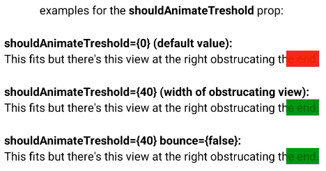

# react-native-text-ticker


## Screenshot




## Description
Inspired from the great [react-native-marquee](https://github.com/kyo504/react-native-marquee), this module acts similarly but with a few extra features and props:

- Don't scroll the text if it fits in the container
- Infinitely scroll text in a ticker fashion
- Bounce text from side to side if it's only slightly wider than its container
- Grab the text and scroll it manually

To see it in action check out the example!

This package aims to only support the latest version of React-Native.

## Installation
```
npm install --save react-native-text-ticker
or
yarn add react-native-text-ticker
```

## Usage
This module can be used as a drop in replacement for the react-native `Text` component (extra props optional).

```
import React, { PureComponent } from 'react'
import { StyleSheet, View } from 'react-native'
import TextTicker from 'react-native-text-ticker'

export default class Example extends PureComponent {
  render(){
    return(
      <View style={styles.container}>
        <TextTicker
          style={{ fontSize: 24 }}
          duration={3000}
          loop
          bounce
          repeatSpacer={50}
          marqueeDelay={1000}
        >
          Super long piece of text is long. The quick brown fox jumps over the lazy dog.
        </TextTicker>
      </View>
    )
  }
}

const styles = StyleSheet.create({
  container: {
    flex: 1,
    justifyContent: 'center',
    alignItems: 'center',
  },
});

```

react-native-text-ticker supports a single child text string, any other use may give unexpected behaviour.


## Properties
| Prop            | Type      | Optional | Default  | Description
|-----------------|-----------|----------|----------|-------------
| style           | StyleObj  | true     | -        | Text Style
| duration        | number    | true     | `150ms` * length of string | Number of milliseconds until animation finishes
| bounceSpeed     | number    | true     |  50      | Describes how fast the bounce animation moves. Effective when duration is not set.
| scrollSpeed     | number    | true     |  150     | Describes how fast the scroll animation moves. Effective when duration is not set.
| animationType   | string    | true     | 'auto'   | one of the values from 'auto', 'scroll', 'bounce'
| loop            | boolean   | true     |  true    | Infinitely scroll the text, effective when animationType is 'auto'
| bounce          | boolean   | true     |  true    | If text is only slightly longer than its container then bounce back/forwards instead of full scroll, effective when animationType is 'auto'
| scroll          | boolean   | true     |  true    | Gives the ability to grab the text and scroll for the user to read themselves. Will start scrolling again after `marqueeDelay` or `3000ms`
| marqueeOnMount  | boolean   | true     |  true    | Will start scroll as soon as component has mounted. Disable if using methods instead.
| marqueeDelay    | number    | true     |  0       | Number of milliseconds to wait before starting marquee
| onMarqueeComplete | function | true    |  -       | This function will run after the text has completely passed across the screen. Will run repeatedly if `loop` is enabled.
| onScrollStart   | function  | true     |  -       | This function will run if the text is long enough to trigger the scroll.
| isInteraction   | boolean   | true     | true     | Whether or not animations create an interaction handle on the `InteractionManager`. Disable if you are having issues with VirtualizedLists not rendering properly.
| useNativeDriver | boolean   | true     | true     | Use native animation driver, should remain true for large majority of use-cases
| repeatSpacer    | number    | true     | 50       | The space between the end of your text string ticker and the beginning of it starting again.  
| bouncePadding    | `{ left: number, right: number }`    | true     | -       | The padding on start/end positions of bounce.  
| bounceDelay    | number  | true     | 0    | How long the animation should wait after each bounce before starting again.   
| easing          | function  | true     | Easing.ease | How the text scrolling animates. Additional options available from the [Easing module](https://facebook.github.io/react-native/docs/easing.html)
| shouldAnimateTreshold | number | true  | 0        | If you have a view drawn over the text at the right (a fade-out gradient for instance) this should be set to the width of the overlaying view: 
| disabled        | boolean   | true     | false    | Disables text animation
| isRTL        | boolean   | true     | false    | If text is right to left (By default, it uses `I18nManager.isRTL` to check)

## Methods
These methods are optional and can be accessed by accessing the ref:

| Prop           | Params    | Description
|----------------|-----------|------------
| startAnimation | delay     | Start animation
| stopAnimation  | -         | Stop animation


## License
[MIT License](https://opensource.org/licenses/MIT)
